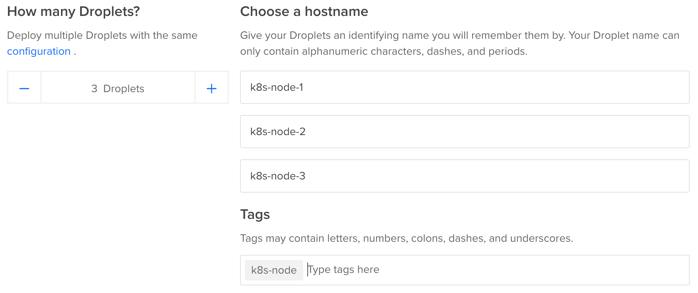
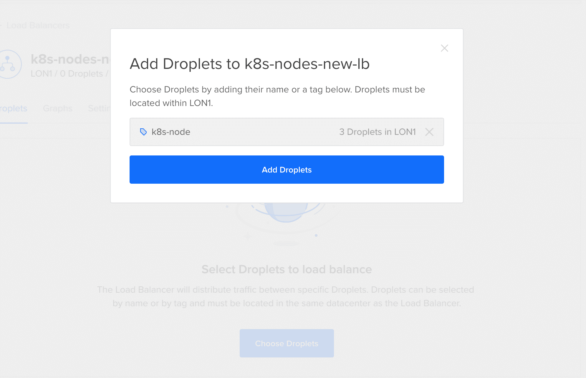
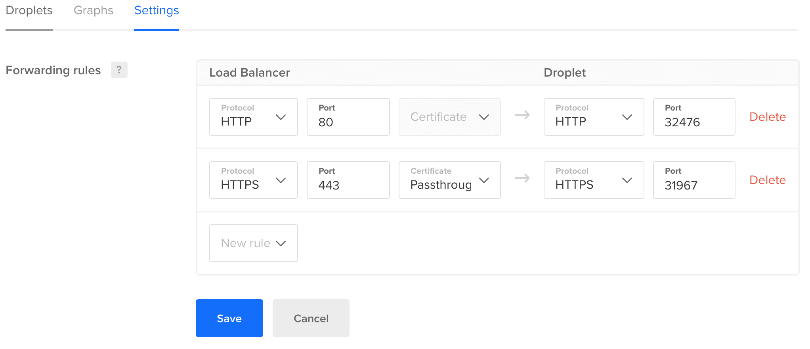
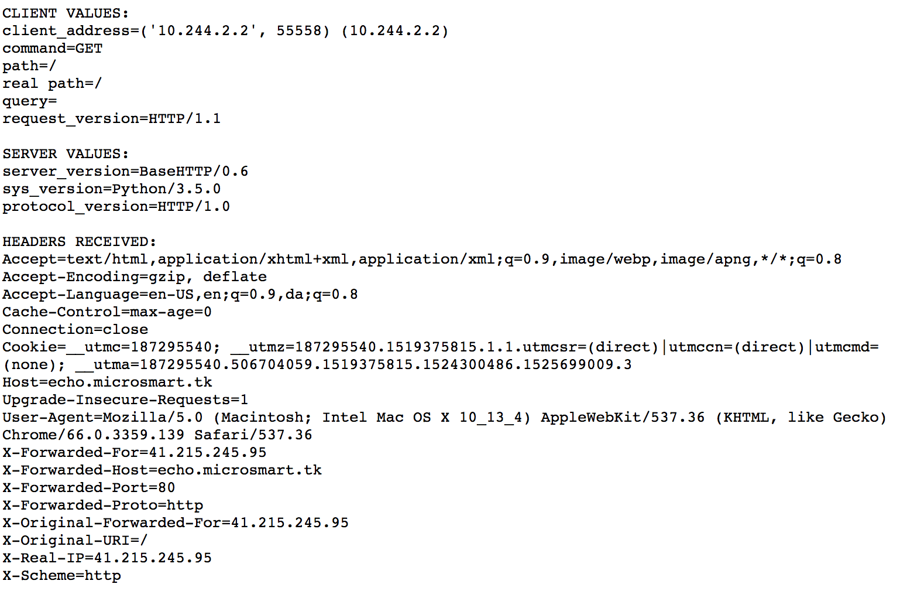

# Kubernetes on DigitalOcean (CoreOS) for $65 - Part I


This is a multipart tutorial and walkthrough on setting up a **$65** kubernetes cluster on DigitalOcean's droplets using CoreOS. It's mostly a manual setup until DigitalOcean releases thier managed kubernetes service [here](https://www.digitalocean.com/products/kubernetes/).

There's also a video tutorial here for those who prefer to watch instead of read.

[Table of Contents]
  * [Prerequisites](#prerequisites)
  * [Kubernetes Master](#kubernetes-master)
    + [Install Kubernetes and Related Services](#install-kubernetes-and-related-services)
    + [Install Script Explained](#install-script-explained)
    + [Initialize Master](#initialize-master)
    + [Configure Access to Cluster](#configure-access-to-cluster)
    + [Install Pod Network Add-on - Flannel Plugin](#install-pod-network-add-on---flannel-plugin)
  * [Kubernetes Worker Nodes](#kubernetes-worker-nodes)
    + [Install Kubernetes](#install-kubernetes)
    + [Join Cluster](#join-cluster)
  * [Configure Nginx Ingress](#configure-nginx-ingress)
  * [Configure a Digital Ocean LoadBalancer](#configure-a-digital-ocean-loadbalancer)
    + [Settings - Forwarding Rules and Health Checks](#settings---forwarding-rules-and-health-checks)
  * [Simple Deployment](#simple-deployment)
  * [Conclusion](#conclusion)


## Prerequisites

1. You'll need a Digital Ocean account, if you don't have you can get one with a free $10 credit [here](https://m.do.co/c/abb066bf4bc9).

2. You'll also need to install `kubectl`

   * If you are on macOS and using [Homebrew](https://brew.sh/) package manager, you can install with: 

     ```bash
     brew install kubectl
     ```

   * On Linux

     ```bash
     curl -LO https://storage.googleapis.com/kubernetes-release/release/$(curl -s https://storage.googleapis.com/kubernetes-release/release/stable.txt)/bin/linux/amd64/kubectl
     chmod +x ./kubectl
     sudo mv ./kubectl /usr/local/bin/kubectl
     ```

   * On Windows

     ```shell
     curl -LO https://storage.googleapis.com/kubernetes-release/release/v1.10.0/bin/windows/amd64/kubectl.exe
     ```
     > Add the binary to your PATH.


## Kubernetes Master

Create a droplet using the **current stable** version of **CoreOS**. Minimum recommended droplet spec: **2GB Ram, 2 vCPU** ($15/month). Choose your preferred region, select private networking, add your ssh-key (you won't be able to create the droplet without it), enter your preferred hostname and finally add the tag `k8s-master`.

> **Note:** Do not add block storage and remember the region used, you'll need it for the worker nodes later on. 

### Install Kubernetes and Related Services

Create and save the following script to `./install-k8s.sh`

```shell
#!/bin/bash

sudo su
echo "Initializing docker service ..."
systemctl enable docker && systemctl start docker
echo "Docker service initialized successfully."

echo "Installing CNI ..."
CNI_VERSION="v0.6.0"
mkdir -p /opt/cni/bin
curl -L "https://github.com/containernetworking/plugins/releases/download/${CNI_VERSION}/cni-plugins-amd64-${CNI_VERSION}.tgz" | tar -C /opt/cni/bin -xz
echo "CNI installation complete."

echo "Installing kubeadm, kubelet & kubectl ..."
RELEASE="$(curl -sSL https://dl.k8s.io/release/stable.txt)"
mkdir -p /opt/bin
cd /opt/bin
curl -L --remote-name-all https://storage.googleapis.com/kubernetes-release/release/${RELEASE}/bin/linux/amd64/{kubeadm,kubelet,kubectl}
chmod +x {kubeadm,kubelet,kubectl}
echo "Kubeadm, kubelet & kubectl installation complete."

echo "Initializing kubelet service ..."
curl -sSL "https://raw.githubusercontent.com/kubernetes/kubernetes/${RELEASE}/build/debs/kubelet.service" | sed "s:/usr/bin:/opt/bin:g" > /etc/systemd/system/kubelet.service
mkdir -p /etc/systemd/system/kubelet.service.d
curl -sSL "https://raw.githubusercontent.com/kubernetes/kubernetes/${RELEASE}/build/debs/10-kubeadm.conf" | sed "s:/usr/bin:/opt/bin:g" > /etc/systemd/system/kubelet.service.d/10-kubeadm.conf
systemctl enable kubelet && systemctl start kubelet
echo "Kubelet service initialized successfully."

echo "Updating PATH ..."
echo 'PATH="$PATH:/opt/bin"' > ~/.bashrc

## Please note that this assumes KUBELET_EXTRA_ARGS hasn’t already been set in the unit file.
echo "Fix Digital Oceans private ip for routing"
IFACE=eth1  # change to eth1 for DO's private network
DROPLET_IP_ADDRESS=$(ip addr show dev $IFACE | awk 'match($0,/inet (([0-9]|\.)+).* scope global/,a) { print a[1]; exit }')
echo $DROPLET_IP_ADDRESS  # check this, just in case
sed -i '2s/^/Environment="KUBELET_EXTRA_ARGS=--node-ip='$DROPLET_IP_ADDRESS'"\n/' /etc/systemd/system/kubelet.service.d/10-kubeadm.conf

echo "Setup Complete"
```


### Install Script Explained

* **Lines 3-6:** Install and enable the `docker` systemd service.
* **Lines 8-12:** Install CNI plugins (required for most pod network).
* **Lines 14-20:** Install `kubeadm`, `kubelet`, `kubectl` binaries.
* **Lines 22-27:** Install and enable `kubelet` systemd service.
* **Lines 29-30:** Add `/opt/bin` to global path to use binaries installed from lines 14-20.
* **Lines 32-37:** Configure the kubelet service to use DigitalOcean's private ip for routing.


Now replace below with the k8s master droplet public ip and run the following commands in your shell:

```shell
MASTER_IP=[droplet-public-ip-goes-here]
ssh core@$MASTER_IP "bash -s" < ./install-k8s.sh
```

All should go well without any issues at this point, if you have issues, please revisit steps again.


### Initialize Master

We will be using the **Flannel** network which requires our pod network cidr to use 10.244.0.0/16 ip range to work properly, so we will pass those options to the `kubeadm init` command.

To initialize the master, ssh into the master:

```shell
ssh core@$MASTER_IP
```

And the run the following commands:

```shell
sudo su
PUBLIC_IP=$(ip -f inet -o addr show eth0|cut -d\  -f 7 | cut -d/ -f 1 | head -n 1)
kubeadm init --apiserver-advertise-address=$PUBLIC_IP  --pod-network-cidr=10.244.0.0/16
exit
exit
```

> **Note:** It might take about a minute or two to complete. Patience my friend, patience.

It should output the following:

```shell
Container Linux by CoreOS stable (1688.5.3)
core@k8s-master ~ $ sudo su
k8s-master core # PUBLIC_IP=$(ip -f inet -o addr show eth0|cut -d\  -f 7 | cut -d/ -f 1 | head -n 1)
k8s-master core # kubeadm init --apiserver-advertise-address=$PUBLIC_IP  --pod-network-cidr=10.244.0.0/16
[init] Using Kubernetes version: v1.10.2
[init] Using Authorization modes: [Node RBAC]
[preflight] Running pre-flight checks.
        [WARNING SystemVerification]: docker version is greater than the most recently validated version. Docker version: 17.12.1-ce. Max validated version: 17.03
        [WARNING Hostname]: hostname "k8s-master" could not be reached
        [WARNING Hostname]: hostname "k8s-master" lookup k8s-master on 67.207.67.3:53: no such host
        [WARNING FileExisting-crictl]: crictl not found in system path
Suggestion: go get github.com/kubernetes-incubator/cri-tools/cmd/crictl
[certificates] Generated ca certificate and key.
[certificates] Generated apiserver certificate and key.
[certificates] apiserver serving cert is signed for DNS names [k8s-master kubernetes kubernetes.default kubernetes.default.svc kubernetes.default.svc.cluster.local] and IPs [10.96.0.1 206.189.30.3]
[certificates] Generated apiserver-kubelet-client certificate and key.
[certificates] Generated etcd/ca certificate and key.
[certificates] Generated etcd/server certificate and key.
[certificates] etcd/server serving cert is signed for DNS names [localhost] and IPs [127.0.0.1]
[certificates] Generated etcd/peer certificate and key.
[certificates] etcd/peer serving cert is signed for DNS names [k8s-master] and IPs [206.189.30.3]
[certificates] Generated etcd/healthcheck-client certificate and key.
[certificates] Generated apiserver-etcd-client certificate and key.
[certificates] Generated sa key and public key.
[certificates] Generated front-proxy-ca certificate and key.
[certificates] Generated front-proxy-client certificate and key.
[certificates] Valid certificates and keys now exist in "/etc/kubernetes/pki"
[kubeconfig] Wrote KubeConfig file to disk: "/etc/kubernetes/admin.conf"
[kubeconfig] Wrote KubeConfig file to disk: "/etc/kubernetes/kubelet.conf"
[kubeconfig] Wrote KubeConfig file to disk: "/etc/kubernetes/controller-manager.conf"
[kubeconfig] Wrote KubeConfig file to disk: "/etc/kubernetes/scheduler.conf"
[controlplane] Wrote Static Pod manifest for component kube-apiserver to "/etc/kubernetes/manifests/kube-apiserver.yaml"
[controlplane] Wrote Static Pod manifest for component kube-controller-manager to "/etc/kubernetes/manifests/kube-controller-manager.yaml"
[controlplane] Wrote Static Pod manifest for component kube-scheduler to "/etc/kubernetes/manifests/kube-scheduler.yaml"
[etcd] Wrote Static Pod manifest for a local etcd instance to "/etc/kubernetes/manifests/etcd.yaml"
[init] Waiting for the kubelet to boot up the control plane as Static Pods from directory "/etc/kubernetes/manifests".
[init] This might take a minute or longer if the control plane images have to be pulled.
[apiclient] All control plane components are healthy after 77.504326 seconds
[uploadconfig] Storing the configuration used in ConfigMap "kubeadm-config" in the "kube-system" Namespace
[markmaster] Will mark node k8s-master as master by adding a label and a taint
[markmaster] Master k8s-master tainted and labelled with key/value: node-role.kubernetes.io/master=""
[bootstraptoken] Using token: <token>
[bootstraptoken] Configured RBAC rules to allow Node Bootstrap tokens to post CSRs in order for nodes to get long term certificate credentials
[bootstraptoken] Configured RBAC rules to allow the csrapprover controller automatically approve CSRs from a Node Bootstrap Token
[bootstraptoken] Configured RBAC rules to allow certificate rotation for all node client certificates in the cluster
[bootstraptoken] Creating the "cluster-info" ConfigMap in the "kube-public" namespace
[addons] Applied essential addon: kube-dns
[addons] Applied essential addon: kube-proxy

Your Kubernetes master has initialized successfully!

To start using your cluster, you need to run the following as a regular user:

  mkdir -p $HOME/.kube
  sudo cp -i /etc/kubernetes/admin.conf $HOME/.kube/config
  sudo chown $(id -u):$(id -g) $HOME/.kube/config

You should now deploy a pod network to the cluster.
Run "kubectl apply -f [podnetwork].yaml" with one of the options listed at:
  https://kubernetes.io/docs/concepts/cluster-administration/addons/

You can now join any number of machines by running the following on each node
as root:

  kubeadm join <master-ip>:<master-port> --token <token> --discovery-token-ca-cert-hash sha256:<hash>
```

> **Note:** Make sure you copy the command on **Line 65** (i've masked my own details), you'll need it for the worker nodes to join the k8s cluster. 


### Configure Access to Cluster

To configure remote access to your cluster as both the remote `core` user and a user on your local machine, run the following commands:

```shell
ssh core@$MASTER_IP
```

```shell
mkdir -p $HOME/.kube
sudo cp -i /etc/kubernetes/admin.conf $HOME/.kube/config
sudo chown $(id -u):$(id -g) $HOME/.kube/config
exit
```

On your **local machine**, run the following commands as a **regular user**:

```shell
mkdir -p $HOME/.kube
scp core@$MASTER_IP:~/.kube/config $HOME/.kube/config
chown $(id -u):$(id -g) $HOME/.kube/config
```

> **Note:** If you have already configured access to other kubenetes clusters, please name the file `$HOME/.kube/config-digital-ocean` or whatever you prefer, and then use with the —kubeconfig option eg: `kubectl --kubeconfig=$HOME/.kube/config-digital-ocean get nodes`


To confirm if you've configured access to your cluster correctly, run the following command:

```shell
kubectl get nodes
```

Which should produce:

```shell
NAME         STATUS     ROLES     AGE       VERSION
k8s-master   NotReady   master    15m       v1.10.2
```

Notice the status is **NotReady**, and it won't be until we bootstrap the worker nodes.


### Install Pod Network Add-on - Flannel Plugin

To install the flannel network add-on plugin, run the following commands:

```shell
ssh core@$MASTER_IP sudo sysctl net.bridge.bridge-nf-call-iptables=1
kubectl apply -f https://raw.githubusercontent.com/coreos/flannel/v0.10.0/Documentation/kube-flannel.yml
```

> **Note:** You **MUST** install a pod network add-on so that your pods can communicate with each other.
>
> **The network must be deployed before any applications. Also, kube-dns, an internal helper service, will not start up before a network is installed. kubeadm only supports Container Network Interface (CNI) based networks (and does not support kubenet).**
>
> Source: [Kubernetes.io](https://kubernetes.io/docs/setup/independent/create-cluster-kubeadm/)


## Kubernetes Worker Nodes

Create **3 identical droplets** using the **current stable** version of **CoreOS**. Minimum recommended droplet spec: **2GB Ram, 1 vCPU** ($10/month). Choose the **same region** used for the k8s-master node, select private networking, add your ssh-key (you won't be able to create the droplet without it), enter your preferred hostname and finally add the tag `k8s-node` to all **worker** nodes (this will be needed later on for the load balancer).

> Note: Do not add block storage.




### Install Kubernetes

For each **worker node ip**, run the following command:

```shell
ssh core@[droplet-worker-node-public-ip] "bash -s" < ./install-k8s.sh
```

Kubenetes and related services are installed now and the workers nodes are ready to join the cluster.


### Join Cluster

Using the command that was output on **Line 65** from the `kubeadm init` command above, we'll run it on each worker node.

For each **worker node ip**, run the following command:

```shell
ssh core@[droplet-worker-node-public-ip] sudo kubeadm join <master-ip>:<master-port> --token <token> --discovery-token-ca-cert-hash sha256:<hash>
```

> **Note:** If you receive any expired token errors, you can always run the following from your **local machine** to get a new token from the **k8s-master**:
>
> ```shell
> ssh core@$MASTER_IP sudo kubeadm token create
> ```

The above command should output the following for each node:

```shell
[preflight] Running pre-flight checks.
        [WARNING SystemVerification]: docker version is greater than the most recently validated version. Docker version: 17.12.1-ce. Max validated version: 17.03
        [WARNING Hostname]: hostname "k8s-node-1" could not be reached
        [WARNING Hostname]: hostname "k8s-node-1" lookup k8s-node-new-1 on 67.207.67.3:53: no such host
[discovery] Trying to connect to API Server "<master-ip>:<master-port>"
[discovery] Created cluster-info discovery client, requesting info from "https://<master-ip>:<master-port>"
[discovery] Requesting info from "https://<master-ip>:<master-port>" again to validate TLS against the pinned public key
        [WARNING FileExisting-crictl]: crictl not found in system path
Suggestion: go get github.com/kubernetes-incubator/cri-tools/cmd/crictl
[discovery] Cluster info signature and contents are valid and TLS certificate validates against pinned roots, will use API Server "<master-ip>:<master-port>"
[discovery] Successfully established connection with API Server "<master-ip>:<master-port>"

This node has joined the cluster:
* Certificate signing request was sent to master and a response
  was received.
* The Kubelet was informed of the new secure connection details.

Run 'kubectl get nodes' on the master to see this node join the cluster.
```


To confirm if nodes have been configured properly, run the following command:

```shell
kubectl get nodes
```

Which should output:

```shell
NAME         STATUS    ROLES     AGE       VERSION
k8s-master   Ready     master    1h        v1.10.2
k8s-node-1   Ready     <none>    3m        v1.10.2
k8s-node-2   Ready     <none>    1m        v1.10.2
k8s-node-3   Ready     <none>    35s       v1.10.2
```

Notice how all the nodes are in **Ready** status. Touchdown!


## Configure Nginx Ingress

With the nginx ingress controller, we can install the **node-port service** (needed for our external load balancer) as well as the need ingress directives for a baremetal kubernetes cluster. Run the following commands to install:

```shell
kubectl apply -f https://raw.githubusercontent.com/kubernetes/ingress-nginx/master/deploy/namespace.yaml
kubectl apply -f https://raw.githubusercontent.com/kubernetes/ingress-nginx/master/deploy/default-backend.yaml
kubectl apply -f https://raw.githubusercontent.com/kubernetes/ingress-nginx/master/deploy/configmap.yaml
kubectl apply -f https://raw.githubusercontent.com/kubernetes/ingress-nginx/master/deploy/tcp-services-configmap.yaml
kubectl apply -f https://raw.githubusercontent.com/kubernetes/ingress-nginx/master/deploy/udp-services-configmap.yaml
kubectl apply -f https://raw.githubusercontent.com/kubernetes/ingress-nginx/master/deploy/rbac.yaml
kubectl apply -f https://raw.githubusercontent.com/kubernetes/ingress-nginx/master/deploy/with-rbac.yaml
kubectl apply -f https://raw.githubusercontent.com/kubernetes/ingress-nginx/master/deploy/provider/baremetal/service-nodeport.yaml
```

> **Note:** This has been installed with the rbac configuration.


To verify if our nginx ingress controller is working, we'll need to get the node port its running on. Run the following command:

```shell
kubectl get svc -n ingress-nginx
```

Which should output:

```shell
NAME                   TYPE        CLUSTER-IP      EXTERNAL-IP   PORT(S)                      AGE
default-http-backend   ClusterIP   10.98.107.241   <none>        80/TCP                       6m
ingress-nginx          NodePort    10.105.47.130   <none>        80:32476/TCP,443:31967/TCP   6m
```

In the **PORT(S)** column for the **ingress-nginx** pod, port **80** maps to **32476** (will be different for you) and port **443** maps to **31967** (will also be different for you). To verify, goto each node's **public ip** on that port and you should see "default backend - 404". If that's the message you see, congrats!


## Configure a Digital Ocean LoadBalancer

Now that we have a fully working kubernetes cluster, we need to make sure our all deployments/pods are reachable from all nodes. Login to your digital ocean account, goto **Networking > Load Balancers > Create Load Balancer** ($20/month), give your load balancer a name, select the **same region** as all the worker nodes and proceed to create it.

Once the load balancer has been created, we'll configure it using the tag `k8s-node` to automatically select all the **worker nodes only**. 




### Settings - Forwarding Rules and Health Checks

To get the load balancer properly working, additional configuration is needed. 

* Goto settings tabs and edit the **forwarding rules**, update the rules to point to the droplets on the node port from ingress-nginx pod service (mine was 80:**32476**/443:**31967**)

  

  > **Note:** Make sure to use passthrough for HTTPS protocol.

* Next goto settings tabs and edit the health checks, update the rule to use **tcp** and point to the droplets on the node port mapped to port 80 from the ingress-nginx pod service (mine was 80:**32476**)

  

Now you can visit the load balancer ip and you should see the "default backend - 404" which represents a round robin connection to all the worker nodes. Hurray!!! You can now configure your domain eg 'example.com' to point to the load balancer ip.


## Simple Deployment

To test if our cluster and deployments works ok, let's deploy a simple echo server.

```yaml
apiVersion: v1
kind: Namespace
metadata:
  name: echoserver
---
apiVersion: extensions/v1beta1
kind: Deployment
metadata:
  name: echoserver
  namespace: echoserver
spec:
  replicas: 3
  template:
    metadata:
      labels:
        app: echoserver
    spec:
      containers:
      - image: gcr.io/google_containers/echoserver:1.0
        imagePullPolicy: Always
        name: echoserver
        ports:
        - containerPort: 8080
---
apiVersion: v1
kind: Service
metadata:
  name: echoserver
  namespace: echoserver
spec:
  ports:
  - port: 80
    targetPort: 8080
    protocol: TCP
  selector:
    app: echoserver
---
apiVersion: extensions/v1beta1
kind: Ingress
metadata:
  name: echoserver
  namespace: echoserver
  annotations:
    kubernetes.io/ingress.class: "nginx"
spec:
  rules:
  - host: echo.[yourdomain.com]
    http:
      paths:
      - path: /
        backend:
          serviceName: echoserver
          servicePort: 80
```

> **Note:** Don't forget to update **Line 47** with your own **domain** pointing to your **load balancer ip**.


Now visit echo.[yourdomain.com], you should see the following:



If you are here, well done.


## Conclusion

You've made it this far, thanks for sticking with me up to this point :). Next on the series, i'ld be writing on  how to add **persistent volume support** backed by using digitalocean's **block storage**, installing **helm** (the kubernetes package manager), installing the **kubernetes dashboard** & **heapster** (for report charts) and finally add automatic **ssl certificates** from **letsencrypt** for our clusters ingress resource created from ingress rules.


I hope this helps someone out there.